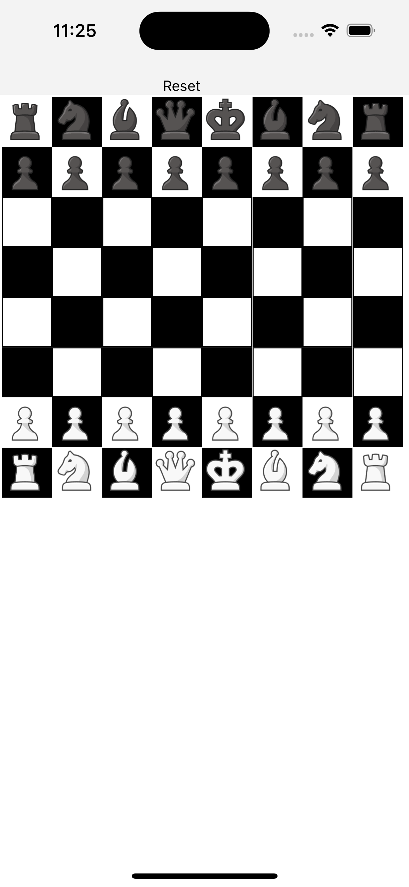

<div align="center" markdown="1">

# react-native-chessboardjs



</div>

# What is react-native-chessboardjs?
react-native-chess-boardjs is a react native based implementation of https://www.npmjs.com/package/react-chessboard

## Installation

```bash
# using npm (will need to register a package name with npm)
npm i react-native-chessboardjs

# OR using Yarn
yarn add react-native-chessboardjs
```

```bash
# Link native libs
cd ios && pod install && cd ..

#if you have any issues try adding the following to your Podfile
pod 'RNReanimated', :path => '../node_modules/react-native-reanimated'
pod 'RNGestureHandler', :path => '../node_modules/react-native-gesture-handler'

```

### Detailed Example
#### IMPORTANT: Examples use the current stable release of chess.js. These examples use chess.js ^1.0.0-beta.6

```jsx
function App(): JSX.Element {
  const [chessGame] = useState(new Chess());
  const [optionSquares, setOptionSquares] = useState({});
  const [moveFrom, setMoveFrom] = useState('');

  const isDarkMode = useColorScheme() === 'dark';

  const backgroundStyle = {
    backgroundColor: isDarkMode ? Colors.darker : Colors.lighter,
  };

  const resetFirstMove = (square: Square) => {
    const hasOptions = getMoveOptions(square);
    if (hasOptions) {
      setMoveFrom(square);
    }
  };

  const getMoveOptions = (square: Square) => {
    const moves = chessGame.moves({
      square,
      verbose: true,
    });
    if (moves.length === 0) {
      return false;
    }

    const newSquares = {} as any;
    moves.map(move => {
      newSquares[move.to] = {
        backgroundColor: 'green',
        height: 15,
        width: 15,
        borderRadius: 50,
      };
      return move;
    });
    setOptionSquares(newSquares);
    return true;
  };

  return (
    <SafeAreaView style={backgroundStyle}>
      <View style={styles.sectionContainer}>
        <Chessboard
          customDarkSquareStyle={styles.customDarkSquareStyle}
          customLightSquareStyle={styles.customLightSquareStyle}
          position={chessGame.fen()}
          customSquareStyles={{
            ...optionSquares,
          }}
          onPieceDrop={(
            sourceSquare: Square,
            targetSquare: Square,
            piece: Piece,
          ) => {
            try {
              chessGame.move({
                from: sourceSquare,
                to: targetSquare,
                promotion: piece?.[1] ?? 'q',
              });
              setMoveFrom('');
              setOptionSquares({});
              return true;
            } catch (e) {}
            return false;
          }}
          onSquareClick={(square: Square) => {
            if (!moveFrom) {
              resetFirstMove(square);
              return false;
            }

            try {
              chessGame.move({
                from: moveFrom,
                to: square,
                // use 'q' if not using selection modal
                promotion: 'q', // this is handled by drop event if onPromotionCheck is set
              });
              setMoveFrom('');
              setOptionSquares({});
              return true;
            } catch (e) {
              // invalid move
              resetFirstMove(square);
            }
            return false;
          }}
          isDraggablePiece={({piece}) => {
            return chessGame.turn() === piece[0];
          }}
          // if a user makes an invalid move attempt they will still see the modal
          // validating moves for promo check requires a bit more work than
          // we show in this example. the if statement can be extended as needed
          onPromotionCheck={(sourceSquare, targetSquare, piece) => {
            if (
              (piece === 'wp' &&
                sourceSquare[1] === '7' &&
                targetSquare[1] === '8') ||
              (piece === 'bp' &&
                sourceSquare[1] === '2' &&
                targetSquare[1] === '1')
            ) {
              // continue...
              // check square range diff
              return (
                Math.abs(
                  sourceSquare.charCodeAt(0) - targetSquare.charCodeAt(0),
                ) <= 1
              );
            }
            return false;
          }}
        />
      </View>
    </SafeAreaView>
  );
}

const styles = StyleSheet.create({
  customDarkSquareStyle: {
    backgroundColor: '#D2691E',
  },
  customLightSquareStyle: {
    backgroundColor: '#DEB887',
  },
  sectionContainer: {
    marginTop: 32,
  },
  sectionTitle: {
    fontSize: 24,
    fontWeight: '600',
  },
  sectionDescription: {
    marginTop: 8,
    fontSize: 18,
    fontWeight: '400',
  },
  highlight: {
    fontWeight: '700',
  },
});

export default App;
```

### Props

| Prop                          | Default Value                                                     | Options                                            | Description                                                                                                                                                                                                                                                                                                                                                                          |
| ----------------------------- | ----------------------------------------------------------------- | -------------------------------------------------- | ------------------------------------------------------------------------------------------------------------------------------------------------------------------------------------------------------------------------------------------------------------------------------------------------------------------------------------------------------------------------------------ |
| boardOrientation              | string: 'white'                                                   | ['white', 'black']                                 | The orientation of the board, the chosen color will be at the bottom of the board. 
| customDarkSquareStyle              | object: { backgroundColor: '#B58863' }                                                  | inline CSS styling                                | Custom dark square style object.
| customLightSquareStyle              | object: { backgroundColor: '#B58863' }                                                  | inline CSS styling                                | Custom light square style object.
| customSquareStyles              | object: {}                                                  | inline CSS styling                                | Custom styles for all squares. object.                                                                                                          
| isDraggablePiece              | function: ({ piece, sourceSquare }) => true                                                                                                                                                                                                                                       | returns [true, false]                              | Function called when a piece drag is attempted. Returns if piece is draggable.                                                                                                                                                                                                                                                                                                       |
| onPieceDrop                   | function: (sourceSquare, targetSquare, piece) => true             | returns [true, false]                              | User function that is run when piece is dropped on a square. Must return whether the move was successful or not. This return value does not control whether or not the piece was placed (as that is controlled by the `position` prop) but instead controls premove logic.
| onPromotionCheck              | function: (sourceSquare, targetSquare, piece) => (((piece === "wP" && sourceSquare[1] === "7" && targetSquare[1] === "8") \|\| (piece === "bP" && sourceSquare[1] === "2" && targetSquare[1] === "1")) && Math.abs(sourceSquare.charCodeAt(0) - targetSquare.charCodeAt(0)) <= 1) | returns [true, false]                              | User function that is run when piece is dropped. Must return whether the move results in a promotion or not.                                                                                                                                                                                                                                                                         |                                                                                                                    
| onSquareClick                   | function: (sourceSquare) => {}             |                              | User function that is run when piece is tapped ('clicked').                                                                                                                                                                                            |
| position                   | Board will render the starting FEN position.            |                              | FEN string notating where the chess pieces are on the board.                                                                                                                                                                                                                                            |

## Contributing

See the [contributing guide](CONTRIBUTING.md) to learn how to contribute to the repository and the development workflow.

## License

MIT

---
