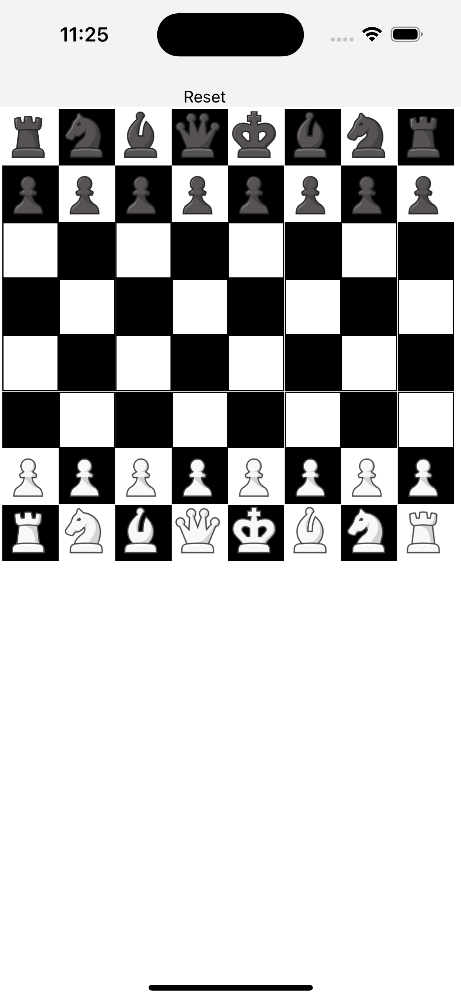

<div align="center" markdown="1">

# react-native-chessboardjs



</div>

## What is react-native-chessboardjs?

A React Native chessboard with drag-and-drop, promotion dialogs, premoves, and customizable styling. Built on **@mgcrea/react-native-dnd** for gestures and **react-native-svg** for piece graphics. The API is inspired by [react-chessboard](https://www.npmjs.com/package/react-chessboard) and uses FEN for position and callbacks for moves, promotion, and square clicks.

## Requirements

- **React** (any recent version; tested with 18.x and 19.x)
- **React Native** (e.g. 0.72+)
- **Node** `>=16`
- **Expo**: works with Expo; if you use a development build, no extra config. Expo Go may work for basic usage; native modules (e.g. gesture handler, reanimated) are part of the SDK.

## Installation

```bash
npm i react-native-chessboardjs
# or
yarn add react-native-chessboardjs
```

### Dependencies

The library ships with these as **dependencies** (they install automatically):

- `@mgcrea/react-native-dnd` ^2.5.3
- `react-native-gesture-handler` ^2.13.2
- `react-native-reanimated` ^3.5.4
- `react-native-svg` ^15.0.0

**Peer dependencies** (your app must provide them):

- `react`
- `react-native`

In a monorepo or with strict peer resolution, ensure the four dependencies above are installed and linked in the app that uses the board.

### Metro configuration (file: link or package outside app root)

If you install the package via `file:` (e.g. `"react-native-chessboardjs": "file:../../react-native-chessboardjs"`) or use it from a path outside your app root, Metro may fail to resolve the module or resolve `react` / `react-native` from the wrong place. In your **app’s** `metro.config.js`, add the package path to `watchFolders` and point `react` and `react-native` at your app’s `node_modules`:

```js
const { getDefaultConfig } = require('expo/metro-config');
const path = require('path');

const config = getDefaultConfig(__dirname);

// Path to the package (adjust if your layout differs)
const linkedPackagePath = path.resolve(__dirname, '../../react-native-chessboardjs');
config.watchFolders = [...(config.watchFolders || []), linkedPackagePath];

// Resolve react/react-native from the app when bundling the linked package
const projectRoot = __dirname;
config.resolver.extraNodeModules = {
  ...config.resolver.extraNodeModules,
  react: path.resolve(projectRoot, 'node_modules/react'),
  'react-native': path.resolve(projectRoot, 'node_modules/react-native'),
};

module.exports = config;
```

Restart Metro with `npx expo start --clear` (or your bundler’s cache-clear) after changing Metro config.

### iOS

```bash
cd ios && pod install && cd ..
```

If you have issues, add to your Podfile:

```ruby
pod 'RNReanimated', :path => '../node_modules/react-native-reanimated'
pod 'RNGestureHandler', :path => '../node_modules/react-native-gesture-handler'
```

### Android

No extra setup beyond linking. Ensure your app has the required native modules for the dependencies above.

## Usage

### TypeScript

Default export is the board; ref and props are typed:

```ts
import Chessboard, { type ClearPremoves, type ChessBoardProps, type Square, type Piece } from 'react-native-chessboardjs';

const ref = useRef<ClearPremoves>(null);

// Clear premoves programmatically (e.g. on square click)
ref.current?.clearPremoves();
ref.current?.clearPremoves(false); // optional: clear last piece colour only
```

### Example

Uses [chess.js](https://github.com/jhlywa/chess.js) (e.g. `^1.2.0`) for move validation.

```tsx
import { useRef, useState } from 'react';
import { View, StyleSheet } from 'react-native';
import Chessboard, { type ClearPremoves } from 'react-native-chessboardjs';
import { Chess } from 'chess.js';

function App() {
  const chessboardRef = useRef<ClearPremoves>(null);
  const [chessGame] = useState(() => new Chess());
  const [optionSquares, setOptionSquares] = useState<Record<string, object>>({});
  const [moveFrom, setMoveFrom] = useState('');

  const resetFirstMove = (square: string) => {
    const hasOptions = getMoveOptions(square);
    if (hasOptions) setMoveFrom(square);
  };

  const getMoveOptions = (square: string) => {
    const moves = chessGame.moves({ square, verbose: true });
    if (moves.length === 0) return false;
    const newSquares: Record<string, object> = {};
    moves.forEach((move) => {
      newSquares[move.to] = {
        backgroundColor: 'green',
        height: 15,
        width: 15,
        borderRadius: 50,
      };
    });
    setOptionSquares(newSquares);
    return true;
  };

  return (
    <View style={styles.container}>
      <Chessboard
        ref={chessboardRef}
        customDarkSquareStyle={styles.customDarkSquareStyle}
        customLightSquareStyle={styles.customLightSquareStyle}
        position={chessGame.fen()}
        customSquareStyles={optionSquares}
        arePremovesAllowed={false}
        onPieceDrop={(sourceSquare, targetSquare, piece) => {
          try {
            chessGame.move({
              from: sourceSquare,
              to: targetSquare,
              promotion: (piece?.[1] ?? 'q') as 'q' | 'r' | 'b' | 'n',
            });
            setMoveFrom('');
            setOptionSquares({});
            return true;
          } catch {
            return false;
          }
        }}
        onSquareClick={(square) => {
          chessboardRef.current?.clearPremoves();
          if (!moveFrom) {
            resetFirstMove(square);
            return true;
          }
          try {
            chessGame.move({
              from: moveFrom,
              to: square,
              promotion: 'q',
            });
            setMoveFrom('');
            setOptionSquares({});
            return true;
          } catch {
            resetFirstMove(square);
            return false;
          }
        }}
        isDraggablePiece={({ piece }) => chessGame.turn() === piece[0]}
        onPromotionCheck={(sourceSquare, targetSquare, piece) => {
          const isPawnPromo =
            (piece === 'wp' && sourceSquare[1] === '7' && targetSquare[1] === '8') ||
            (piece === 'bp' && sourceSquare[1] === '2' && targetSquare[1] === '1');
          return isPawnPromo && Math.abs(sourceSquare.charCodeAt(0) - targetSquare.charCodeAt(0)) <= 1;
        }}
      />
    </View>
  );
}

const styles = StyleSheet.create({
  container: { flex: 1, marginTop: 32 },
  customDarkSquareStyle: { backgroundColor: '#D2691E' },
  customLightSquareStyle: { backgroundColor: '#DEB887' },
});

export default App;
```

## Props

In callbacks, **piece** uses a lowercase letter: `'wk'`, `'bq'`, `'wp'`, etc. (e.g. white king = `'wk'`, black pawn = `'bp'`).

| Prop | Default | Description |
|------|---------|-------------|
| `ref` | — | Optional. Ref object with `clearPremoves(clearLastPieceColour?: boolean)` to clear the premove queue (e.g. on square click). |
| `boardOrientation` | `'white'` | `'white'` or `'black'`. The chosen color is at the bottom. |
| `customDarkSquareStyle` | `{ backgroundColor: 'black' }` | Style object for dark squares. |
| `customLightSquareStyle` | `{ backgroundColor: 'white' }` | Style object for light squares. |
| `customBoardStyle` | — | Style object for the board container (e.g. border). |
| `customSquareStyles` | `{}` | Keyed by square (e.g. `'e4'`). Styles applied on top of base square styles. |
| `position` | Start FEN | FEN string for the board position. Use `'start'` or the standard start FEN for the initial position. |
| `size` | — | Optional `{ width, height }`. Board width; height unused. If omitted, uses window width. |
| `onPress` | — | Optional. If provided, wraps the board in a touchable and calls this on press. |
| `onPieceDrop` | **required** | `(sourceSquare, targetSquare, piece) => boolean`. Called when a piece is dropped. Return `true` if the move is accepted. |
| `onSquareClick` | `() => true` | `(square) => boolean`. Called when a square is tapped. |
| `onPromotionCheck` | — | `(sourceSquare, targetSquare, piece) => boolean`. Return `true` when the move is a promotion (promotion dialog is shown). |
| `isDraggablePiece` | `() => true` | `({ piece }) => boolean`. Return `false` to disable dragging for that piece. |
| `arePremovesAllowed` | `false` | If `true`, the user can queue a move when it is not their turn (executed when the turn switches). |
| `whiteKingInCheck` | `false` | When `true`, highlights the white king square (e.g. red) to show check. |
| `blackKingInCheck` | `false` | When `true`, highlights the black king square to show check. |

## Contributing

See the [contributing guide](CONTRIBUTING.md) for development workflow and how to contribute.

## License

MIT
