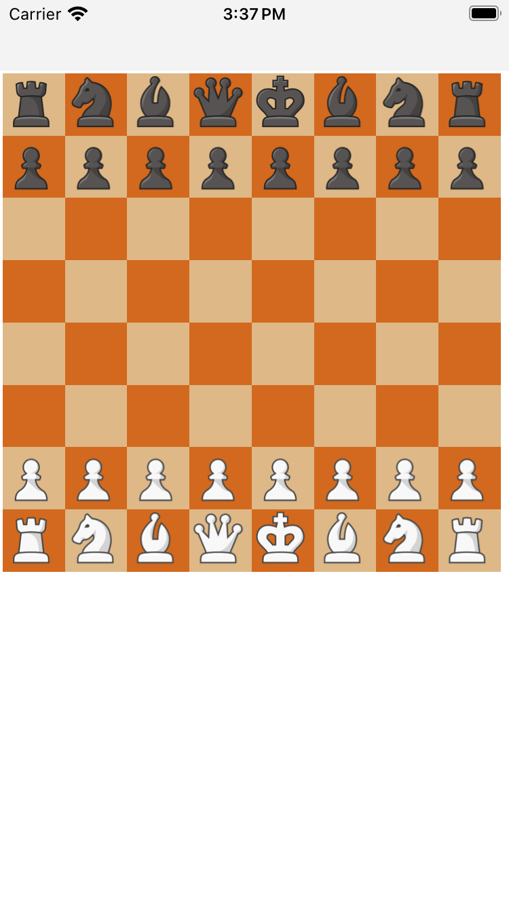

<div align="center" markdown="1">

# [react-native-chess-board](https://react-chessboard.vercel.app/)



</div>

# What is react-native-chess-board?
react-native-chess-board is a react native based implementation of https://www.npmjs.com/package/react-chessboard

## Installation

```bash
# using npm (will need to register a package name with npm)
npm i react-native-chess-board

# OR using Yarn
yarn add react-native-chess-board
```

### Props

| Prop                          | Default Value                                                     | Options                                            | Description                                                                                                                                                                                                                                                                                                                                                                          |
| ----------------------------- | ----------------------------------------------------------------- | -------------------------------------------------- | ------------------------------------------------------------------------------------------------------------------------------------------------------------------------------------------------------------------------------------------------------------------------------------------------------------------------------------------------------------------------------------ |
| boardOrientation              | string: 'white'                                                   | ['white', 'black']                                 | The orientation of the board, the chosen color will be at the bottom of the board. 
| customDarkSquareStyle              | object: { backgroundColor: '#B58863' }                                                  | inline CSS styling                                | Custom dark square style object.
| customLightSquareStyle              | object: { backgroundColor: '#B58863' }                                                  | inline CSS styling                                | Custom light square style object.
| customSquareStyles              | object: {}                                                  | inline CSS styling                                | Custom styles for all squares. object.                                                                                                          
| onPieceDrop                   | function: (sourceSquare, targetSquare) => true             | returns [true, false]                              | User function that is run when piece is dropped on a square. Must return whether the move was successful or not. This return value does not control whether or not the piece was placed (as that is controlled by the `position` prop) but instead controls premove logic.                                                                                                                             
| onSquareClick                   | function: (sourceSquare) => {}             |                              | User function that is run when piece is tapped ('clicked').                                                                                                                                                                                            |
| position                   | Board will render the starting FEN position.            |                              | FEN string notating where the chess pieces are on the board.                                                                                                                                                                                                                                            |

## Contributing

See the [contributing guide](CONTRIBUTING.md) to learn how to contribute to the repository and the development workflow.

## License

MIT

---
